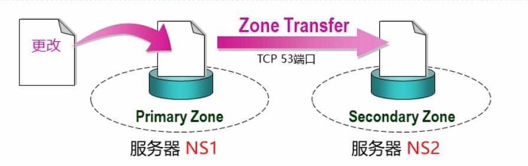
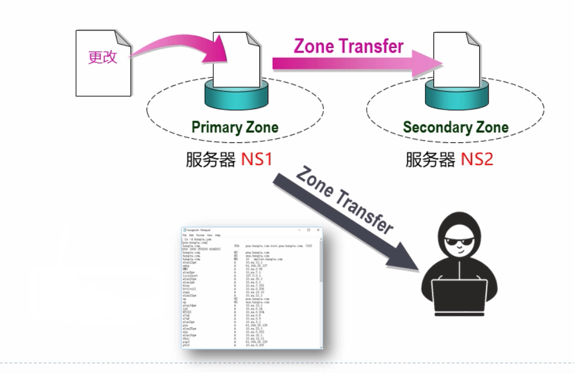

## 区域传递与区域类型



| 区域 | 描述 |
| --- | --- |
| 主要Primary | DNS的一个读写副本 |
| 辅助Secondary | DNS的一个只读副本，需要指定复制的master |
| 存根Stub | 只包含用于定位名称服务器的记录的区域，需要指定复制的Master |
| 活动目录集成（ActiveDirectoryIntegrated）| 区域数据保存在活动目录而不是保存在区域文件中（微软独有） |

注意Bind并不支持最后一种活动目录集成的方式。

区域传递支持的是增量区域传递


## 区域传递的安全性



使用allow-transfer来实现安全加固，如果说缺少allow-transfer配置，那么就会允许所有主机的区域传递请求。

### 方案1：allow-transfer

> 指定地址匹配列表`allow-transfer { address_match_list };`

如：全局配置

```shell
options {
   ...
   // 默认拒绝所有
   allow-transfer { none ; };
}
...
```
指定zone进行配置
```shell
zone "example.com" IN {
    ....
    // 为指定zone显示的指定
    allow-transfer { localhost; 192.168.1.232; 172.16.1.0/24; };
}
```

进行测试，如
```shell
host -t AXFR kuaishou.com 1.1.1.1
```

### 方案2：TSIG

> TSIG（TransactionSignature）使用签名的密钥进行验证，这样的方式安全性会高很多。


## 区域传递的时机

主DNS服务器的通知机制

- 当Zone数据文件有变化，主DNS服务器会默认通知辅助DNS服务器
- 默认是通知Zone中NS记录所指定的DNS服务器
- 辅助DNS服务器收到通知的时候，联系主DNS服务器，对比序列号并进行同步

我们可以使用rndc触发数据同步
```shell
rndc notify example.com
```

辅助DNS服务器：

- 根据SOA记录的Refresh参数，定期联系主服务器，对比序列号并进行数据同步
- 如果某次Refresh失败，根据SOA记录的Retry参数所设置的间隔进行尝试。

或者使用命令进行重新同步传输，如

```shell
rndc retransfer example.com
```
