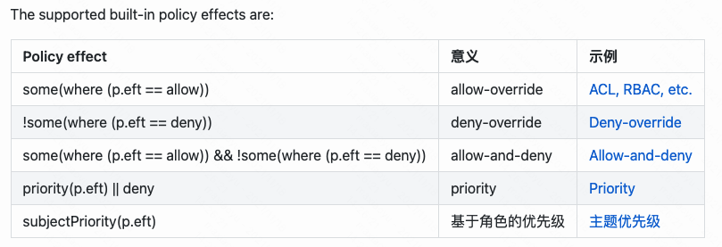

> - casbin官方网站：[https://casbin.org/zh-CN/](https://casbin.org/zh-CN/)
> - casbin编辑器：[https://casbin.org/zh-CN/editor](https://casbin.org/zh-CN/editor)

PERM元模型(P for policy, E for Effect, R for Request, M for Matchers)

- subject：访问的实体sub，谁请求
- object：obj，访问的资源，我要访问什么？
- action：act访问方法，我要以什么方式请求。
- effect：eft策略结果一般为空，默认就是allow（其实还可以定义为deny，只有allow和deny）

Policy策略：p = {sub, obj, act, eft}，策略一般存储到数据库，因为策略会有很多

Matchers匹配规则：Request请求以及Policy策略的匹配规则
```shell
m：r.sub == p.sub && r.act == p.act && r.obj == p.obj
```
其中r表示请求，p表示策略。这时候会把r和p按照上述描述进行匹配，从而返回匹配结果（eft）如果补丁已会返回allow，如果定义过了会返回我们定义的那个结果。

Effect影响：effect决定我们是否可以放行
```shell
e = some(where(p.eft == allow)) 这种情况下，我们的一个matchers匹配完成，得到了allow那么这条请求就会放行
e = some(where(p.eft == allow)) && !some(where(p.eft == deny)) 针对两个匹配到的p的情况
比如说：
p, alice, data1, write allow
p, alice, data1, write deny
如果说走e = some(where(p.eft == allow))这个p的话，那么只要有存在allow的，那就是返回true。有的时候可能不会满足需求。但是当使用e = some(where(p.eft == allow)) && !some(where(p.eft == deny)) 的时候两个策略以&&连接做与关系，只要存在错误的，那就是false。
```
支持的effect是定义好的，一共就可用的那么几个。你要是用别的，会告诉你不合法。



Request请求：r = {sub,obj,act}

简单来说就是，我定义一个策略（P），一个匹配规则（M），通过请求（R）过来的参数与策略通过规则进行匹配，获得一个effect（E），然后在影响的表达式中返回一个布尔值

角色域：

role_definition

```shell
# 以角色为基础，表示用户是什么角色
g = _, _ 
# 以域为基础，多商户模式（标明用户是哪个角色，哪一个商户。）
g = _, _, _
```
举例说明：

```ini
# model定义
[request_definition]
r = sub, obj, act

[policy_definition]
p = sub, obj, act

[role_definition]
# 其实这个情况下，g写啥都行，毕竟match里面根本没有涉及到g，但是规范来讲还是应该用g = _, _ 的方式来写，对应的其实就是g = 用户, 角色
g = _, _

[policy_effect]
e = some(where (p.eft == allow))

[matchers]
m = g(r.sub, p.sub) && r.obj == p.obj && r.act == p.act
```
策略的定义
```shell
p, alice, data1, read
p, bob, data2, write
p, data2_admin, data2, read
p, data2_admin, data2, write

g, alice, data2_admin
```
比如说R是
```shell
alice, data2, read
```
首先R来了以后，先匹配P中的g这条策略，会匹配到alice是data2_admin这个role角色。所以说匹配完了以后这个R就变成了`data2_admin, data2, read`，同时R依然可以作为`alice, data2,read`使用。如果说p中存在两条记录的话，那么就同时都可以用。

简单来说吧，`g(r.sub, p.sub)`给R的subject多赋予了一个身份就是data2_admin

多租户模型

Model
```ini
[request_definition]
r = sub, dom, obj, act

[policy_definition]
p = sub, dom, obj, act

[role_definition]
g = _, _, _

[policy_effect]
e = some(where (p.eft == allow))

[matchers]
m = g(r.sub, p.sub, r.dom) && r.dom == p.dom && r.obj == p.obj && r.act == p.act
```

Policy
```shell
p, admin, domain1, data1, read
p, admin, domain1, data1, write
p, admin, domain2, data2, read
p, admin, domain2, data2, write

g, alice, admin, domain1
g, bob, admin, domain2
```

R为：`alice, domain1, data1, read`