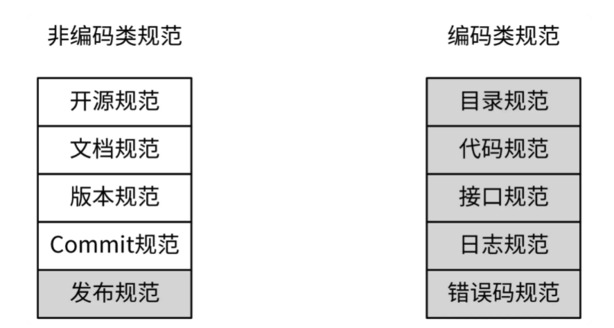
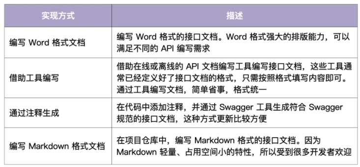

没有统一的规范会造成哪些问题
- 代码风格不一
- 目录杂乱无章：没有统一的目录规范，可能同一类的功能放在不同的目录不同的文件等。这样会降低代码的可维护性。
- 接口不统一
- 错误码不规范

## 规范概述

有哪些地方需要定制规范
- 非编码类规范，主要包含开源规范，文档规范，版本规范，commit规范和发布规范
- 编码类规范，比如目录规范，代码规范，接口规范，日志规范和错误码规范。

### 开源规范

### 文档规范

#### README规范

#### 项目文档规范

#### API接口文档

编写详尽的借口文档便于前后端开发完成以后直接进行联调，提高开发效率。项目后期，还可以提供给使用者，降低组件的使用门槛的同时减少沟通的成本。

编写借口文档可以使用Word，工具（比如一些编辑器，在线文档等），通过注释生成和编写Markdown格式文档，具体可以参考下面的图。

相对来讲，通过注释以及markdown来生成文档的方式使用的较多，我个人使用markdown也是习惯了，各种性质的文档其实都在使用markdown

- 相比通过注释生成的方式，编写markdown格式的借口文档囊，能表达更丰富的内容和格式，不需要在代码中添加大量注释。
- 相比word，markdown占用空间更小，能随着代码仓库一起发布，方便API文档的分发和查找。
- 相比在线工具，markdown格式的文档免去了第三方平台的依赖和网络的限制。

API文档要包含以下内容：

- 完整的API接口介绍文档
- API接口变更历史文档
- 通用说明
- 数据结构说明
- 错误码描述和
- API接口使用文档：接口描述、请求方法、请求参数、输出参数、请求示例、响应示例
