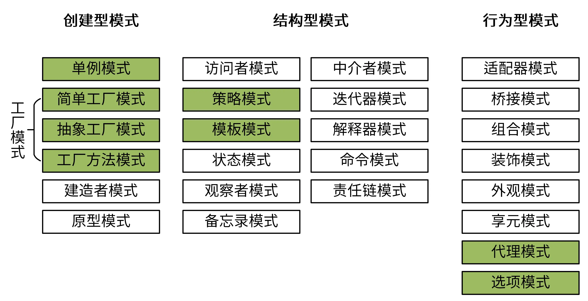

设计模式是啥呢？简单来说，就是将软件开发中需要重复性解决的编码场景，按最佳实践的方式抽象成一个模型，模型描述的解决方法就是设计模式。使用设计模式，可以使代码更易于理解，保证代码的重用性和可靠性。

在软件领域，GoF（四人帮，全拼 Gang of Four）首次系统化提出了 3 大类、共 25 种可复用的经典设计方案，来解决常见的软件设计问题，为可复用软件设计奠定了一定的理论基础。从总体上说，这些设计模式可以分为创建型模式、结构型模式、行为型模式 3 大类，用来完成不同的场景。其中，简单工厂模式、抽象工厂模式和工厂方法模式都属于工厂模式。

