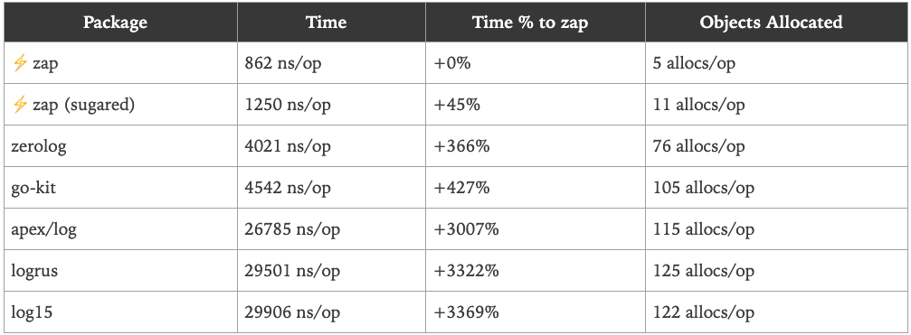
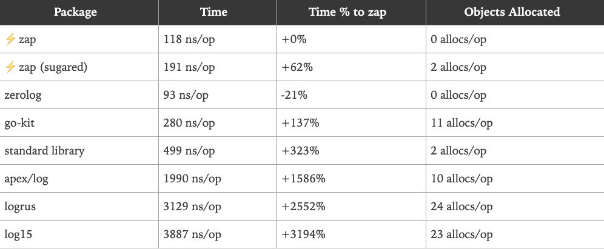

## 介绍

在许多Go语言项目中，我们需要一个好的日志记录器能够提供下面这些功能：

- 能够将事件记录到文件中，而不是应用程序控制台。
- 日志切割-能够根据文件大小、时间或间隔等来切割日志文件。
- 支持不同的日志级别。例如INFO，DEBUG，ERROR等。
- 能够打印基本信息，如调用文件/函数名和行号，日志时间等。

## 默认的Go Logger

在介绍Uber-go的zap包之前，让我们先看看Go语言提供的基本日志功能。Go语言提供的默认日志包是[https://golang.org/pkg/log/](https://golang.org/pkg/log/)

### 实现GoLogger

#### 设置Logger

实现一个Go语言中的日志记录器非常简单——创建一个新的日志文件，然后设置它为日志的输出位置。

```go
func SetupLogger() {
	logFileLocation, _ := os.OpenFile("/Users/q1mi/test.log", os.O_CREATE|os.O_APPEND|os.O_RDWR, 0744)
	log.SetOutput(logFileLocation)
}
```

#### 使用Logger

让我们来写一些虚拟的代码来使用这个日志记录器。

在当前的示例中，我们将建立一个到URL的HTTP连接，并将状态代码/错误记录到日志文件中。

```go
func simpleHttpGet(url string) {
	resp, err := http.Get(url)
	if err != nil {
		log.Printf("Error fetching url %s : %s", url, err.Error())
	} else {
		log.Printf("Status Code for %s : %s", url, resp.Status)
		resp.Body.Close()
	}
}
```

#### logger的运行

现在让我们执行上面的代码并查看日志记录器的运行情况。

```go
func main() {
	SetupLogger()
	simpleHttpGet("www.google.com")
	simpleHttpGet("http://www.google.com")
}
```

当我们执行上面的代码，我们能看到一个test.log文件被创建，下面的内容会被添加到这个日志文件中。

```shell
2019/05/24 01:14:13 Error fetching url www.google.com : Get www.google.com: unsupported protocol scheme ""
2019/05/24 01:14:14 Status Code for http://www.google.com : 200 OK
```

### Go Logger的优势和劣势

**优势**

它最大的优点是使用非常简单。我们可以设置任何io.Writer作为日志记录输出并向其发送要写入的日志。

**劣势**

- 仅限基本的日志级别
  - 只有一个Print选项。不支持INFO/DEBUG等多个级别。
- 对于错误日志，它有Fatal和Panic
  - Fatal日志通过调用os.Exit(1)来结束程序
  - Panic日志在写入日志消息之后抛出一个panic
  - 但是它缺少一个ERROR日志级别，这个级别可以在不抛出panic或退出程序的情况下记录错误
- 缺乏日志格式化的能力——例如记录调用者的函数名和行号，格式化日期和时间格式。等等。
- 不提供日志切割的能力。

## Uber Zap

Zap是非常快的、结构化的，分日志级别的Go日志库。

### 为什么选择Uber-go zap

- 它同时提供了结构化日志记录和printf风格的日志记录
- 它非常的快

根据Uber-go Zap的文档，它的性能比类似的结构化日志包更好——也比标准库更快。 以下是Zap发布的基准测试信息

记录一条消息和10个字段:



记录一个静态字符串，没有任何上下文或printf风格的模板：



### 安装

运行下面的命令安装zap

```shell
go get -u go.uber.org/zap
```

### 配置Zap Logger

Zap提供了两种类型的日志记录器—Sugared Logger和Logger。

在性能很好但不是很关键的上下文中，使用SugaredLogger。它比其他结构化日志记录包快4-10倍，并且支持结构化和printf风格的日志记录。

在每一微秒和每一次内存分配都很重要的上下文中，使用Logger。它甚至比SugaredLogger更快，内存分配次数也更少，但它只支持强类型的结构化日志记录。

#### Logger

- 通过调用`zap.NewProduction()`/`zap.NewDevelopment()`或者`zap.Example()`创建一个Logger。
- 上面的每一个函数都将创建一个logger。唯一的区别在于它将记录的信息不同。例如production logger默认记录调用函数信息、日期和时间等。
- 通过Logger调用Info/Error等。
- 默认情况下日志都会打印到应用程序的console界面。

我们首先使用普通的logger来做一个简单的测试
```go
package main

import (
	"net/http"

	"go.uber.org/zap"
)

var logger *zap.Logger

// InitProductionLogger ...
func InitProductionLogger() {
	logger, _ = zap.NewProduction()
}

func simpleHTTPGet(url string) {
	resp, err := http.Get(url)
	if err != nil {
		logger.Error(
			"Error fetching url...",
			zap.String("url", url),
			zap.Error(err),
		)
	} else {
		logger.Info("Success...",
			zap.String("statusCode", resp.Status),
			zap.String("url", url),
		)
		resp.Body.Close()
	}
}

func main() {
	InitProductionLogger()
	// 在程序退出之前，把缓冲区的日志都刷到磁盘里。
	defer logger.Sync()

	simpleHTTPGet("http://www.baidu.com")
}
```
最后打印出来的结果如下：
```shell
[root@xeq-vm-197-77-opsorder-test zap-demo]# go run main.go 
{"level":"info","ts":1622196068.7713954,"caller":"zap-demo/main.go:25","msg":"Success...","statusCode":"200 OK","url":"http://www.baidu.com"}
```
在上面的代码中，我们首先创建了一个Logger，然后使用Info/ Error等Logger方法记录消息。日志记录器的语法是这样的
```go
func (log *Logger) MethodXXX(msg string, fields ...Field) 
```
这个`MethodXXX`可能是Info,Error,Debug,Panic等等，每一个方法都接收一个消息字符串还有任意数量的`zapcore.Field`参数，以Info级别的日志为例
```go
// Info logs a message at InfoLevel. The message includes any fields passed
// at the log site, as well as any fields accumulated on the logger.
func (log *Logger) Info(msg string, fields ...Field) {
	if ce := log.check(InfoLevel, msg); ce != nil {
		ce.Write(fields...)
	}
}
```

#### SugarLogger

SugarLogger的调用方式和Logger大同小异，稍微有一些不太一样的地方

- 大部分的实现基本都相同。
- 惟一的区别是，我们通过调用主logger的. Sugar()方法来获取一个SugaredLogger。
- 然后使用SugaredLogger以printf格式记录语句

```go
package main

import (
	"net/http"
	"go.uber.org/zap"
)

var sugarlogger *zap.SugaredLogger

// InitProductionSugarLogger ...
func InitProductionSugarLogger() {
	logger, _ := zap.NewProduction()
	sugarlogger = logger.Sugar()
}

func simpleHTTPGet(url string) {
	sugarlogger.Debug("Trying to hit Get request for %s")
	resp, err := http.Get(url)
	if err != nil {
		sugarlogger.Error(
			"Error fetching url...",
			zap.String("url", url),
			zap.Error(err),
		)
	} else {
		sugarlogger.Info("Success...",
			zap.String("statusCode", resp.Status),
			zap.String("url", url),
		)
		resp.Body.Close()
	}
}

func main() {
	InitProductionSugarLogger()
	// 在程序退出之前，把缓冲区的日志都刷到磁盘里。
	defer sugarlogger.Sync()
	simpleHTTPGet("http://www.baidu.com")
}
```
输出的结果为
```shell
[root@xeq-vm-197-77-opsorder-test zap-demo]# go run main.go 
{"level":"info","ts":1622198680.0117903,"caller":"zap-demo/main.go:26","msg":"Success...{statusCode 15 0 200 OK <nil>} {url 15 0 http://www.baidu.com <nil>}"}
```
刚才用的是`zap.NewProduction`，那么接下来用一下develop的试试
```go
// InitProductionSugarLogger ...
func InitProductionSugarLogger() {
	logger, _ := zap.NewDevelopment()
	sugarlogger = logger.Sugar()
}
```
然后我们再看一下日志的数据
```shell
[root@xeq-vm-197-77-opsorder-test zap-demo]# go run main.go 
2021-05-28T18:47:35.750+0800    DEBUG   zap-demo/main.go:17     Trying to hit Get request for %s
2021-05-28T18:47:35.941+0800    INFO    zap-demo/main.go:26     Success...{statusCode 15 0 200 OK <nil>} {url 15 0 http://www.baidu.com <nil>}
```
这个就是开发环境，比较适合在终端输出的日志了。

### 定制Logger

#### 将日志写入文件而不是终端

我们要做的第一个更改是把日志写入文件，而不是打印到应用程序控制台。

- 我们将使用zap.New(…)方法来手动传递所有配置，而不是使用像zap.NewProduction()这样的预置方法来创建logger。

```go
func New(core zapcore.Core, options ...Option) *Logger
```
`zapcore.Core`需要三个配置，分别为`Encoder`，`WriteSyncer`，`LogLevel`.

**1、Encoder**

编码器(如何写入日志)。我们将使用开箱即用的NewJSONEncoder()，并使用预先设置的ProductionEncoderConfig()。

```go
zapcore.NewJSONEncoder(zap.NewProductionEncoderConfig())
```
**2、WriterSyncer**

指定日志将写到哪里去。我们使用zapcore.AddSync()函数并且将打开的文件句柄传进去。

```go
file, _ := os.Create("./test.log")
writeSyncer := zapcore.AddSync(file)
```

**3、log level**

哪种级别的日志将被写入

那么重新改造过后的代码就变成了下面这个样子

```go
package main

import (
	"net/http"
	"os"

	"go.uber.org/zap"
	"go.uber.org/zap/zapcore"
)

var sugarlogger *zap.SugaredLogger

// InitLogger ...
func InitLogger() {
	writeSyncer := getLogWriter()
	encoder := getEncoder()
	core := zapcore.NewCore(encoder, writeSyncer, zapcore.DebugLevel)
	logger := zap.New(core)
	sugarlogger = logger.Sugar()
}

func getLogWriter() zapcore.WriteSyncer {
	file, _ := os.Create("./test.log")
	return zapcore.AddSync(file)
}

func getEncoder() zapcore.Encoder {
	return zapcore.NewJSONEncoder(zap.NewProductionEncoderConfig())
}

func simpleHTTPGet(url string) {
	sugarlogger.Debug("Trying to hit Get request for %s")
	resp, err := http.Get(url)
	if err != nil {
		sugarlogger.Error(
			"Error fetching url...",
			zap.String("url", url),
			zap.Error(err),
		)
	} else {
		sugarlogger.Info("Success...",
			zap.String("statusCode", resp.Status),
			zap.String("url", url),
		)
		resp.Body.Close()
	}
}

func main() {
	InitLogger()
	// 在程序退出之前，把缓冲区的日志都刷到磁盘里。
	defer sugarlogger.Sync()
	simpleHTTPGet("http://www.baidu.com")
}
```
这个时候我们运行完了以后，发现其实终端什么都没有输出，但是我们发现同级目录下多出来了一个test.log的文件，我们可以看一下
```shell
[root@xeq-vm-197-77-opsorder-test zap-demo]# cat test.log 
{"level":"debug","ts":1622199436.791037,"msg":"Trying to hit Get request for %s"}
{"level":"info","ts":1622199436.990979,"msg":"Success...{statusCode 15 0 200 OK <nil>} {url 15 0 http://www.baidu.com <nil>}"}
```
上面我使用了Debug的level，其实还有很多level，这些都是常量。
```go
type Level int8

const (
	// DebugLevel logs are typically voluminous, and are usually disabled in
	// production.
	DebugLevel Level = iota - 1
	// InfoLevel is the default logging priority.
	InfoLevel
	// WarnLevel logs are more important than Info, but don't need individual
	// human review.
	WarnLevel
	// ErrorLevel logs are high-priority. If an application is running smoothly,
	// it shouldn't generate any error-level logs.
	ErrorLevel
	// DPanicLevel logs are particularly important errors. In development the
	// logger panics after writing the message.
	DPanicLevel
	// PanicLevel logs a message, then panics.
	PanicLevel
	// FatalLevel logs a message, then calls os.Exit(1).
	FatalLevel

	_minLevel = DebugLevel
	_maxLevel = FatalLevel
)
```

#### 将JSON Encoder更改为普通的Log Encoder

现在，我们希望将编码器从`JSON Encoder`更改为普通Encoder。为此，我们需要将`NewJSONEncoder()`更改为`NewConsoleEncoder()`。

```go
return zapcore.NewConsoleEncoder(zap.NewProductionEncoderConfig())
```
那么日志的结果就是下面这个样子
```shell
1.6223397950440078e+09	debug	Trying to hit Get request for %s
1.6223397961095738e+09	error	Error fetching url...{url 15 0 http://www.baidu.com <nil>} {error 26 0  Get "http://www.baidu.com": dial tcp: lookup www.baidu.com on 8.8.8.8:53: read udp 172.18.196.77:40945->8.8.8.8:53: i/o timeout}
```

#### 文件的追加

我们发现说每次文件都是清空重写，那么这个时候，我们可以利用到os包的一些文件属性，然后让文件可以是追加的。
```go
file, _ := os.OpenFile("./test.log", os.O_CREATE|os.O_APPEND|os.O_RDWR, 0744)
```

#### 更改时间编码并添加调用者详细信息

鉴于我们对配置所做的更改，有下面两个问题：

- 时间是以非人类可读的方式展示，例如1.572161051846623e+09
- 调用方函数的详细信息没有显示在日志中

我们要做的第一件事是覆盖默认的`ProductionConfig()`，并进行以下更改:

- 修改时间编码器
- 在日志文件中使用大写字母记录日志级别

```go
func getEncoder() zapcore.Encoder {
	encoderConfig := zap.NewProductionEncoderConfig()
	// 设置时间格式为ISO8601的一个时间格式
	encoderConfig.EncodeTime = zapcore.ISO8601TimeEncoder
	// 设置日志的级别为答谢
	encoderConfig.EncodeLevel = zapcore.CapitalLevelEncoder
	return zapcore.NewConsoleEncoder(encoderConfig)
}
```
接下来，我们将修改zap logger代码，添加将调用函数信息记录到日志中的功能。为此，我们将在`zap.New(..)`函数中添加一个Option。
```go
// addcaller就是把调用函数的相关信息添加进去。
logger := zap.New(core, zap.AddCaller())
```
当使用这些修改过的logger配置调用上述部分的main()函数时，以下输出将打印在文件`test.log`中，那么输出的结果就是下面这个样子的。
```shell
2021-05-30T10:07:14.890+0800	DEBUG	zap-demo/main.go:37	Trying to hit Get request for %s
2021-05-30T10:07:15.066+0800	INFO	zap-demo/main.go:46	Success...{statusCode 15 0 200 OK <nil>} {url 15 0 http://www.baidu.com <nil>}
```

其实`zap.NewProductionEncoderConfig`就是构造了一个结构体，那么如果知道它是构造了一个结构体的话，那么我们自己其实也是可以定制的，比如里面的timekey，levelkey等等信息。
```go
func NewProductionEncoderConfig() zapcore.EncoderConfig {
	return zapcore.EncoderConfig{
		TimeKey:        "ts",
		LevelKey:       "level",
		NameKey:        "logger",
		CallerKey:      "caller",
		FunctionKey:    zapcore.OmitKey,
		MessageKey:     "msg",
		StacktraceKey:  "stacktrace",
		LineEnding:     zapcore.DefaultLineEnding,
		EncodeLevel:    zapcore.LowercaseLevelEncoder,
		EncodeTime:     zapcore.EpochTimeEncoder,
		EncodeDuration: zapcore.SecondsDurationEncoder,
		EncodeCaller:   zapcore.ShortCallerEncoder,
	}
}
```
那么其实我上面的getEncode也可以写为下面这个样子，然后自己去定制一下我们的日志相关的信息。
```go
func getEncoder() zapcore.Encoder {
	encoderConfig := zapcore.EncoderConfig{
		TimeKey:        "ts",
		LevelKey:       "level",
		NameKey:        "logger",
		CallerKey:      "caller",
		FunctionKey:    zapcore.OmitKey,
		MessageKey:     "msg",
		StacktraceKey:  "stacktrace",
		LineEnding:     zapcore.DefaultLineEnding,
		EncodeLevel:    zapcore.CapitalLevelEncoder,
		EncodeTime:     zapcore.ISO8601TimeEncoder,
		EncodeDuration: zapcore.SecondsDurationEncoder,
		EncodeCaller:   zapcore.ShortCallerEncoder,
	}
	return zapcore.NewConsoleEncoder(encoderConfig)
}
```

那么拓展一下，接下来我既想要在文件中写入又想在终端中输出改怎么办？


### 日志的切割归档

> 首先Zap库并不支持归档和切割日志文件，因此需要一个第三方的库来实现，就是[Lumberjack](https://github.com/natefinch/lumberjack)，这个不支持按照时间进行切割文件。当然如果说在服务器上，我们也可以使用logrotate，这样就无所谓了，我们也可以不用这个包。

#### 安装

```go
go get -u github.com/natefinch/lumberjack
```

#### zap logger中加入Lumberjack

要在zap中加入Lumberjack支持，我们需要修改WriteSyncer代码。我们将按照下面的代码修改getLogWriter()函数：

```go
func getLogWriter() zapcore.WriteSyncer {
	lumberJackLogger := &lumberjack.Logger{
		Filename:   "./test.log",
		MaxSize:    10,
		MaxBackups: 5,
		MaxAge:     30,
		Compress:   false,
	}
	return zapcore.AddSync(lumberJackLogger)
}
```

Lumberjack Logger采用以下属性作为输入:

- Filename: 日志文件的位置
- MaxSize：在进行切割之前，日志文件的最大大小（以MB为单位）
- MaxBackups：保留旧文件的最大个数
- MaxAges：保留旧文件的最大天数
- Compress：是否压缩/归档旧文件

## Zip with Gin

### Gin框架中的默认中间件

首先我们来看一个最简单的gin项目：

```go
func main() {
	r := gin.Default()
	r.GET("/hello", func(c *gin.Context) {
		c.String("hello liwenzhou.com!")
	})
	r.Run(
}
```
接下来我们看一下`gin.Default()`的源码：

```go
func Default() *Engine {
	debugPrintWARNINGDefault()
	engine := New()
	engine.Use(Logger(), Recovery())
	return engine
}
```

也就是我们在使用`gin.Default()`的同时是用到了gin框架内的两个默认中间件`Logger()`和`Recovery()`。

其中`Logger()`是把gin框架本身的日志输出到标准输出（我们本地开发调试时在终端输出的那些日志就是它的功劳），而`Recovery()`是在程序出现panic的时候恢复现场并写入500响应的。

### 基于zap的中间件

我们可以模仿Logger()和Recovery()的实现，使用我们的日志库来接收gin框架默认输出的日志。下面的代码重写了这两个中间件然后进行了应用。
```go
package main

import (
	"net"
	"net/http"
	"net/http/httputil"
	"os"
	"runtime/debug"
	"strings"
	"time"
	"github.com/gin-gonic/gin"
	"github.com/natefinch/lumberjack"
	"go.uber.org/zap"
	"go.uber.org/zap/zapcore"
)

var sugarlogger *zap.SugaredLogger

// InitLogger ...
func InitLogger() {
	writeSyncer := getLogWriter()
	encoder := getEncoder()
	core := zapcore.NewCore(encoder, writeSyncer, zapcore.DebugLevel)
	logger := zap.New(core, zap.AddCaller())
	sugarlogger = logger.Sugar()
}

func getLogWriter() zapcore.WriteSyncer {
	luberJackLogger := &lumberjack.Logger{
		Filename:   "./test.log",
		MaxSize:    10,
		MaxBackups: 5,
		MaxAge:     30,
		Compress:   false,
	}
	return zapcore.AddSync(luberJackLogger)
}

func getEncoder() zapcore.Encoder {
	encoderConfig := zapcore.EncoderConfig{
		TimeKey:        "ts",
		LevelKey:       "level",
		NameKey:        "logger",
		CallerKey:      "caller",
		FunctionKey:    zapcore.OmitKey,
		MessageKey:     "msg",
		StacktraceKey:  "stacktrace",
		LineEnding:     zapcore.DefaultLineEnding,
		EncodeLevel:    zapcore.CapitalLevelEncoder,
		EncodeTime:     zapcore.ISO8601TimeEncoder,
		EncodeDuration: zapcore.SecondsDurationEncoder,
		EncodeCaller:   zapcore.ShortCallerEncoder,
	}
	return zapcore.NewJSONEncoder(encoderConfig)
}

// GinLogger 接收gin框架默认的日志
func GinLogger(logger *zap.SugaredLogger) gin.HandlerFunc {
	return func(c *gin.Context) {
		start := time.Now()
		path := c.Request.URL.Path
		query := c.Request.URL.RawQuery
		c.Next()

		cost := time.Since(start)
		logger.Info(path,
			zap.Int("status", c.Writer.Status()),
			zap.String("method", c.Request.Method),
			zap.String("path", path),
			zap.String("query", query),
			zap.String("ip", c.ClientIP()),
			zap.String("user-agent", c.Request.UserAgent()),
			zap.String("errors", c.Errors.ByType(gin.ErrorTypePrivate).String()),
			zap.Duration("cost", cost),
		)
	}
}

// GinRecovery recover掉项目可能出现的panic
func GinRecovery(logger *zap.SugaredLogger, stack bool) gin.HandlerFunc {
	return func(c *gin.Context) {
		defer func() {
			if err := recover(); err != nil {
				// Check for a broken connection, as it is not really a
				// condition that warrants a panic stack trace.
				var brokenPipe bool
				if ne, ok := err.(*net.OpError); ok {
					if se, ok := ne.Err.(*os.SyscallError); ok {
						if strings.Contains(strings.ToLower(se.Error()), "broken pipe") || strings.Contains(strings.ToLower(se.Error()), "connection reset by peer") {
							brokenPipe = true
						}
					}
				}

				httpRequest, _ := httputil.DumpRequest(c.Request, false)
				if brokenPipe {
					logger.Error(c.Request.URL.Path,
						zap.Any("error", err),
						zap.String("request", string(httpRequest)),
					)
					// If the connection is dead, we can't write a status to it.
					c.Error(err.(error)) // nolint: errcheck
					c.Abort()
					return
				}

				if stack {
					logger.Error("[Recovery from panic]",
						zap.Any("error", err),
						zap.String("request", string(httpRequest)),
						zap.String("stack", string(debug.Stack())),
					)
				} else {
					logger.Error("[Recovery from panic]",
						zap.Any("error", err),
						zap.String("request", string(httpRequest)),
					)
				}
				c.AbortWithStatus(http.StatusInternalServerError)
			}
		}()
		c.Next()
	}
}

func main() {
	InitLogger()
	r := gin.New()
	r.Use(GinLogger(sugarlogger), GinRecovery(sugarlogger, true))
	r.GET("/hello", func(c *gin.Context) {
		c.String(http.StatusOK, "hello world!")
	})
	r.Run(":10086")
}
```
那么在实际的gin项目中，我们应该把上面的逻辑抽象出来一个logger.go的配置文件，具体的配置文件如下
```go

```


## 参考文档

- [在Go语言项目中使用Zap日志库](https://www.liwenzhou.com/posts/Go/zap/)