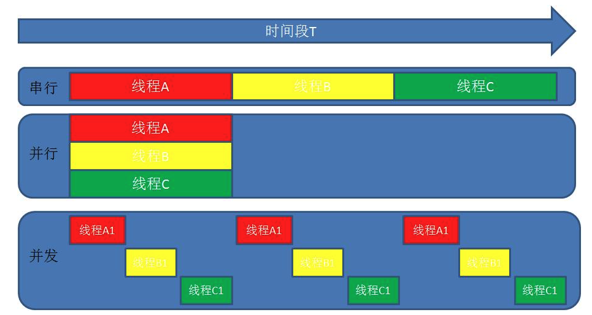

## 进程&线程

## 并发 and 并行

## C10K问题

## 并发模型

### 异步非阻塞（Nginx，LibEvent，NodeJS）

复杂度较高

### 协程（Golang，Erlang，Lua）

- 在golang中，协程叫做gorouting
- 多个goroutine之间的数据同步和通信是通过channels
- 多个channel通过select选择数据读取或者写入。

## 并发资源操作

> 比如说多个Goroutine并发更新同一个资源，比如说计数器