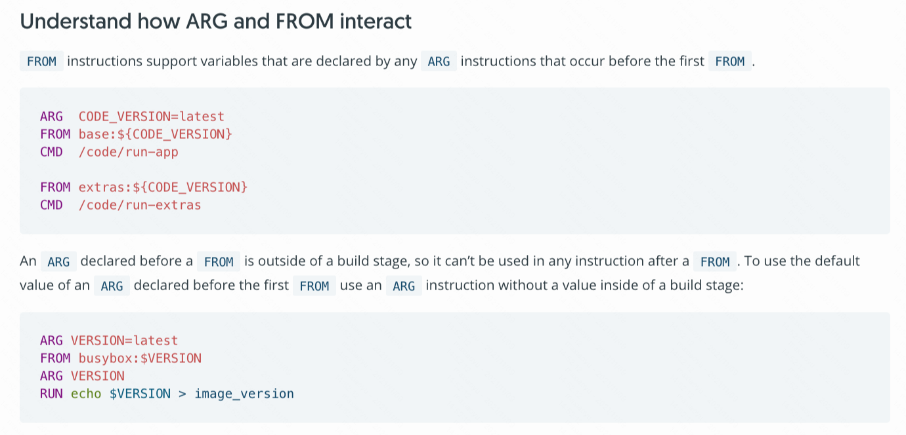

## ARG

### 利用ARG使Dockerfile适用多分支构建

当我们的配置环境不同的时候可能会存在网络隔离，那么Dockerfile引用的Base镜像地址就可以无法访问。除此之外，如果说在qa分支FROM的base镜像写死的话，那么merge到master的时候也会覆盖掉master，致使生产环境构建的FROM的是qa环境的base镜像，会引发一系列的问题，因此当遇到这种问题的时候，我们需要把Dockerfile这个字段给搞成活的。当我们传递不同变量的时候，会引用不同的Base镜像，以传参的方式解决不同环境的问题。比如

```dockerfile
ARG REGISTRY_ADDR
FROM ${REGISTRY_ADDR}/kwai-it-public/centos:7-Python3
MAINTAINER Kwai IT Team <gaoning@kuaishou.com
ARG CONFIG_ENV
ENV PROJECT_PROFILE $CONFIG_ENV

………………略………………
```
这里着重记录一下，我们看到上面的ARG可以写在FROM的上面，也可以写在FROM的下面，但是写在不同的位置的意义是不一样的。Github上针对ARG的位置不同的作用也有过讨论，可以参考

- [ARG before FROM in Dockerfile doesn't behave as expected #34129](https://github.com/moby/moby/issues/34129)
- [官方参考文档](https://docs.docker.com/engine/reference/builder/#from)

官方的解释如下：



简单来说，只有ARG这一个指令可以放在FROM之前，但是特殊的地方在于在FROM之上的这个ARG它是独立于build stage之外的，因此在FROM接下来的过程中都是无法使用ARG所定义的内容的，只有FROM本身可以用。因此如果你想要通过--build-arg来传递一个参数在构建过程中也去使用的话，需要在FROM下面也声明一个ARG，在FROM下面声明的ARG是贯穿整个build stage的。

因此如果你想要声明一个ARG在整个build stage构建过程中都可以使用的话，你需要在FROM的下面声明，否则这是无法使用的，如果说你要声明的这个ARG你只想给FROM使用，那么你可以写到FROM的上面。

那么在构建的时候如何去使用呢？通过`--build-arg`传递过去。
```shell
docker build -t testimage:v1 --build-arg REGISTRY_ADDR=${dockerRegistryUrl} .
```

### 多阶段构建ARG的引用问题

!!! note
    背景：当前我要构建一个项目，我使用了多阶段构建，在第一阶段打包二进制文件，在第二阶段直接封装二进制文件到运行环境。那么这个封装过程中，应用需要声明一些环境变量，这些变量值随环境不同而不同，比如说测试环境变量值叫qa，生产环境叫prod，因此我需要在build的时候，将变量以构建参数的形式传递进来。

在多阶段构建的前提下，整个一个Dockerfile的执行被分为了两个build stage。因此如果说你声明了某个ARG，那么这个ARG只能在当前那个build stage生效，如果想要在另外的build stage生效的话，那么你必须重新声明。举个简单的例子，比如说：

```dockerfile
ARG DARSHAN_VER=3.1.6

FROM fedora:29 as build
ARG DARSHAN_VER
RUN dnf install -y \
        gcc \
        make \
        bzip2 bzip2-devel zlib zlib-devel
RUN curl -O "ftp://ftp.mcs.anl.gov/pub/darshan/releases/darshan-${DARSHAN_VER}.tar.gz" \
    && tar ...


FROM fedora:29
ARG DARSHAN_VER
COPY --from=build "/usr/local/darshan-${DARSHAN_VER}" "/usr/local/darshan-${DARSHAN_VER}"
...
```
如果在第二个阶段不再声明一次ARG的话，那么这个DARSHAN_VER就是不可用的，这一点要格外注意。