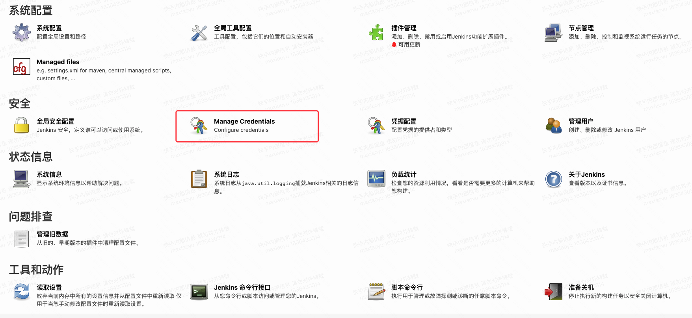
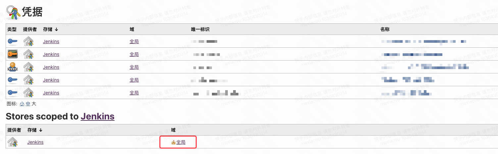
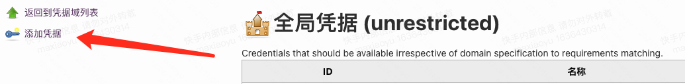
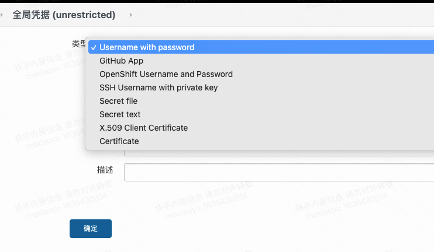
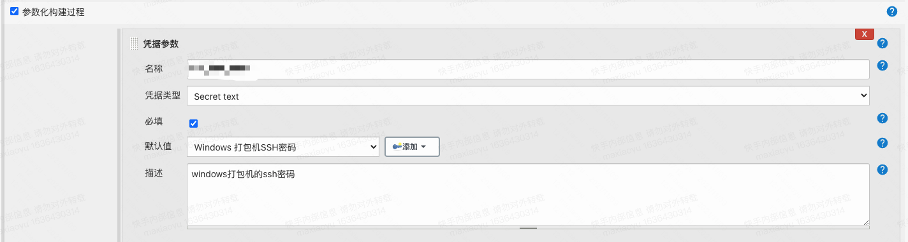
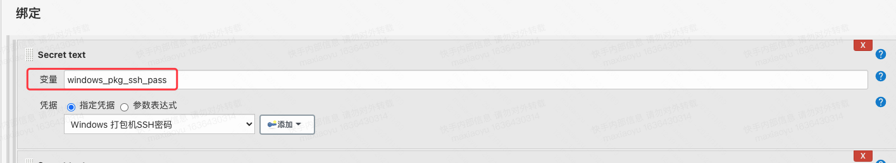
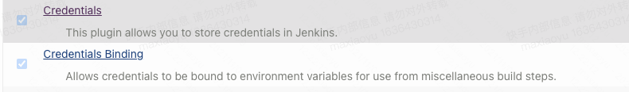

!!! note
    需求背景：使用Electron打包windows的client端，需要用指定的打包机，如果说不指定打包机的话，没有对应的签名，会被360等安全软件标记为恶意软件。因此这里使用Jenkins当了一个跳板去借助Windows的机器去操作，期间遇到的一些问题，在这里做一下记录。

基本的处理思路，是通过ssh和windows打包机之间建立关联，通过把git仓库拉过来的源代码推送到windows，然后在win上完成一系列的操作。

## 安全问题

- [PipeLine数据脱敏](https://blog.51cto.com/u_15127505/2655449)
- [Jenkins凭据管理，看这一篇就够了](https://www.cnblogs.com/FLY_DREAM/p/13888423.html)
- [流水线数据脱敏](https://cloud.tencent.com/developer/article/1672920)

### 密码的明文问题

现在通过sshpass接密码的方式进行ssh访问，用的账户是Administrator，本来以为，在`c:\Users\Administrator\.ssh\authorized_keys`下添加了jenkins的公钥就可以免密登录了，但是发现实际上并不可以，无奈先使用sshpass进行访问。

那么当使用sshpass的时候就涉及到使用`-p`指定密码，如果说我在shell构建过程中，直接使用了明文的密码，那么在构建过程中的console log中，我是可以直接看到这个明文的密码的，也就是说非常的不安全。因此这里就需要添加凭据。

以admin身份登录Jenkins，在左侧找到系统管理，点击进入，就会看到如下的界面，当然可能不同版本的jenkins其实这一块的界面显示可能是不一样的，不过这个并不是一个很严重的问题，只要仔细找一下，基本该有的都有



点击Manage Credentials，然后我们就可以看到凭据的管理界面了，



点击到全局，然后我们在左侧列表页添加一个凭据



然后我们就可以根据分类进行添加了。比如我这里是密码类型的，因此我就选择的是Secret Text，类似的还有后面我会用到的往cdn上传数据是用到的token，也可以用这个secret text来保存。



对应的凭据我们要唯一标识写好。现在添加完标识以后，接下来就是要使用，使用分两步，添加凭据和绑定凭据

### 添加凭据

要想在job中使用凭据，需要先做凭据的添加，我这里使用的是参数化构建传参的方式添加的。



### 使用凭据

添加完参数还不算完，当前是不能通过`${唯一标识}`来拿到对应的数据的，我们还需要做Binding。



做完Binding以后，最后我们要使用的是binding后的这个变量。这样我们在build stage中的shell模块中就可以调用这个变量了。

### Tip

当然凭据的管理是依赖插件的，如果说你根本没安装插件的话，那么上述的操作就无从谈起了。因此需要先进行插件的安装。




## Windows CMD操作的相关小记

因为是直接ssh到windows的CMD，所以很多操作就没有图形界面那么便利，比如说文件的解压，在查询了一番以后发现，有一些简单的小工具可以实现这个功能

- [unzip解压](http://stahlworks.com/dev/index.php?tool=zipunzip)

cmd常用命令

```powershell
# 一行执行多条命令，使用&符号连接，两条命令都会执行，不关心前面的命令是否执行成功还是失败
d: & cd d:\test & mkdir project
# 前面的命令执行成功了才会执行后面的命令。
node a.js && node b.js
# 前面的命令执行成功则不执行后面的，若执行失败再执行后面的。
node a.js || node b.js
# 查看文件内容，类似linux里的cat
more filename.txt
type filename.txt
# 新建空文件
type nul> newtest.txt 或者 type nul>.txt
# 新建非空文件
echo 文件中的内容>a.txt
# 删除文件
del newtest.txt
# 静默删除递归目录，适用于目录非空，且不需要交互的情况下
# /s 代表删除所有子目录以及其中的档案
# /q 非交互，删的时候别问我yes or no
rd /s/q d:\test
```


