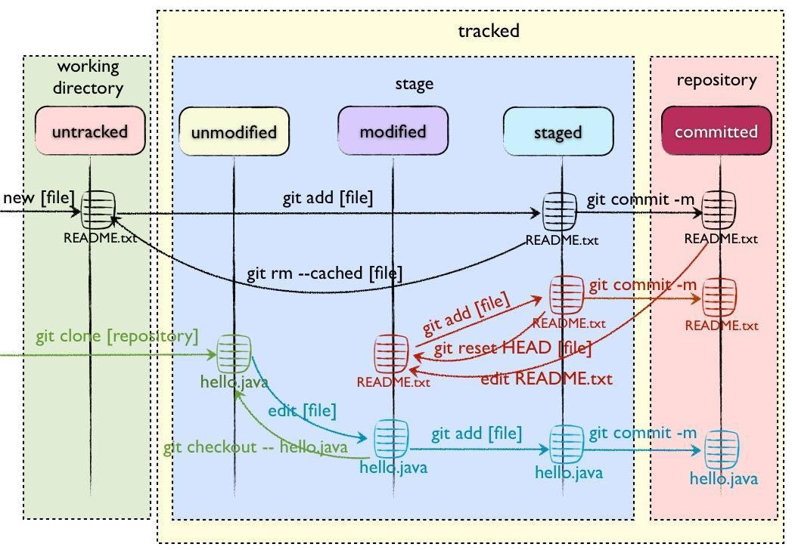

## 配置初始化的信息

```shell
git config --global user.name <your name>
git config --global user.email <your email>
```

这里默认的就是使用global的作用域，即全局生效，对应的config一共有三个作用域

- global：对当前用户所有仓库都有效
- local（缺省）: 只对某个仓库有效
- system：对系统所有登录的用户都有效

我们可以通过`--list`的方式来查看config的配置

```shell
git config --list --local
git config --list --global
git config --list --system
```

示例：
```shell
~# git config --list --global
user.name=<your name>
user.email=<your email>
push.default=matching
```
## 加入Git仓库的两种方式

### 远端仓库没有建好

```shell
echo "# git_study" >> README.md
git init
git add README.md
git commit -m "first commit"
git branch -M main
git remote add origin https://github.com/LamberMa/git_study.git
git push -u origin main
```

### 远端仓库已建好

远端仓库已建好，但是对应的是一个空的repo

```shell
git init
git remote add origin https://github.com/LamberMa/git_study.git
echo "hello git" > index.html
git add index.html
git commit -m "first commit"
git push -u origin master
```

远端仓库已建好，并且对应的repo非空

```shell
git clone https://github.com/LamberMa/git_study.git
然后做一些变更
git add .
git commit -m "first commit"
git push origin master
```

## Git常用命令

### 添加文件

git add 添加文件

```shell
git add xxxx
git add -p
```

git add 可以添加文件也可以添加文件夹


### 删除文件

重命名文件在git中是怎么判定的呢，比如说你把一个文件a重命名为文件b，那么对于git来讲，相当于你删除了a，然后新建了b，此时你需要在版本库中新增b，然后删除a

```shell
git add b
git rm a
```

那么虽然你这样操作了，git也知道你是对一个文件rename重命名了。

其实上面的操作可以简化为

```shell
git mv a b
```


### 清理暂存区

```shell
git reset --hard
```

### 查看日志

```shell
git log
# 放到一行去显示，类似于一个简便的查看方式
git log --oneline
# 查看最近n次的一个提交
git log -n2 --oneline
# 查看所有分支的log，默认只是查看当前分支的。
git log --all
# 带图形化的一个分支log展示，可以看到相关的branch关联关系。
git log --all --graph
```

### 查看分支

```shell
git branch
git branch -v
```

### 查看文件

```shell
git cat-file 
```

### 查看diff

```shell
# 对比commit1和commit2的区别
git diff commit1 commit2
# 对比当前HEAD所指向的commit，以及HEAD的父节点的commit id的区别，HEAD^1就是指代HEAD的父亲节点，那么祖父节点可以用HEAD^1^1，那么HAED^1也可以直接简写为HAED^或者用HAED~1来替代
# HEAD^1^1可以用HEAD^^来替换，或者使用HAED~2
git diff HEAD HEAD^1
```

### 仓库clone

```shell
git clone 
```

### fetch获取

```shell
git fetch
```

### 合并

```shell
# 合并两棵独立的树
git merge --allow-unrelated-histories <branch_name>
```

### 切换分支

```shell
# 新建分支xxx并切换过去
git checkout -b xxx
# 新建和远端一样的分支并切换过去，这里是基于远端分支新建的，远端的分支是origin的feature/add_git_commands
git checkout -b feature/add_git_commands origin/feature/add_git_commands
# 普通的切换本地分支
git checkout xxx
```


## 理解暂存区

我们用的git add files只是将对应的文件添加到暂存区，并不是提交，当commit的时候才是真正的提交



当我们新增文件并添加到暂存区时候（git add之后），这个时候，在.git中的objects中就已经创建了blob文件，那么当我们提交commit之后，对应的生成相关的tree，比如commit的tree。还有对应的blob

## 一些容易混淆的概念

### author or committer

一般来讲author和committer是一致的，但是有一种情况下是不一致的，比如说你一个项目，你想用master一个commit的代码然后做一些变更放到temp分支，这个时候git为了尊重版权，author仍然是原commit的作者，但是committer是你。这个时候就会出现author和committer不一致的情况。


## .git结构

首先查看一下`.git`的目录结构

```shell
# tree . -L 1
.
├── branches
├── COMMIT_EDITMSG
├── config
├── description
├── HEAD
├── hooks
├── index
├── info
├── logs
├── objects
└── refs
```

### HEAD

HEAD记录当前git指向的分支
```shell
# cat HEAD 
ref: refs/heads/master
```

### config

config文件记录的是仓库相关配置的信息，比如我们上面提到的用户名或者email

```shell
# cat config 
[core]
        repositoryformatversion = 0
        filemode = true
        bare = false
        logallrefupdates = true
[remote "origin"]
        url = https://xxxx.git
        fetch = +refs/heads/*:refs/remotes/origin/*
```

### refs

refs,这里其实就是指代的我们引用的资源

```shell
# cd refs/
# ls -l
total 0
drwxr-xr-x 2 root root 20 Nov 26 12:35 heads
drwxr-xr-x 2 root root  6 Nov 26 12:33 tags
```

其中heads保存了对应的分支信息，tags则保存了相关的标签信息。

```shell
# cd heads/
# ls -l
total 4
-rw-r--r-- 1 root root 41 Nov 26 12:35 master
# cat master 
d99f02dcc248e1d042843cdc85288c09219db53a
```

进入到head目录，我们就能看到对应的分支文件了，我这里目前只有一个分支master，所以目录下就仅有master一个文件。那么查看这个master，这个master记录的是当前master分支的最新的那个commit的id。

### objects

objects是git中核心保存内容的地方

```shell
# cd objects/
# ls -l
total 0
drwxr-xr-x 2 root root 52 Nov 26 12:35 09
drwxr-xr-x 2 root root 52 Nov 26 12:35 8d
drwxr-xr-x 2 root root 52 Nov 26 12:35 d9
drwxr-xr-x 2 root root  6 Nov 26 12:33 info
drwxr-xr-x 2 root root  6 Nov 26 12:33 pack
```
可以看到有对应的很多两个字母的文件夹，这些文件夹里其实保存的就是相关的一些数据，而pack是打包目录，当这种两个字符的文件夹多的时候，git会进行打包整理并丢到pack目录中， 接下来我们看一下其中一个文件夹里的内容是什么。

```shell
# cd 09
# ls -l
total 4
-r--r--r-- 1 root root 54 Nov 26 12:35 0bfa626329168a87a62fb0281e205fc0879c37
# git cat-file -t 090bfa626329168a87a62fb0281e205fc0879c37
tree
```
进入到09目录，可以看到一个文件，这个文件其实挺像一个commit id。那么这个内容其实是和整个git树相关的，那么我们要向查看它的话，需要将目录名09以及它下面的这个文件名拼起来，也就是`090bfa626329168a87a62fb0281e205fc0879c37`。可以发现它的类型是一个树，那么这个树节点具体保存的内容是什么呢？

```shell
# git cat-file -p 090bfa626329168a87a62fb0281e205fc0879c37
100644 blob 8d0e41234f24b6da002d962a26c2495ea16a425f    index.html
```

blob指代的是文件对象，这个内容保存的是index.html，其中中间这一段字符串是文件的hash，我们可以通过查看这段hash查看文件的内容

```shell
# git cat-file -p 8d0e41234f24b6da002d962a26c2495ea16a425f 
hello git
```