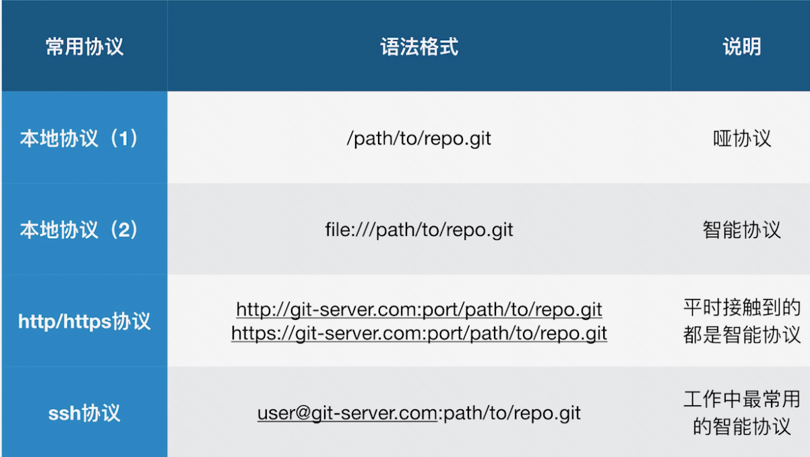

## 删除不必要的分支

```shell
git branch -d branch_name
# 如果说报error: The branch xxx is not fully merged。那么，可以使用强制删除
git branch -D branch_name
```

## 如何修改commit的message

```shell
# 修改最新的commit
git commit --amend
```

那么如何修改老旧的commit提交呢。看下面的例子，比如说，我这里有几个commit

```shell
# git log --all --graph
* commit 536f63764660ce34927fc1b9b5361e241d07a1dd
| Author: hahaha <hahaha@163.com>
| Date:   Fri Nov 26 16:54:25 2021 +0800
| 
|     add 404
|  
* commit f0536a66498639bc1fb8604de8dfdb58ba0ff977
| Author: hahaha <hahaha@163.com>
| Date:   Fri Nov 26 16:53:17 2021 +0800
| 
|     update
|  
* commit 0e1539f5edf81cc5442b2e21238c7610abaf7da7
| Author: hahaha <hahaha@163.com>
| Date:   Fri Nov 26 16:52:45 2021 +0800
| 
|     add python file
|  
* commit d99f02dcc248e1d042843cdc85288c09219db53a
  Author: hahaha <hahaha@163.com>
  Date:   Fri Nov 26 12:35:47 2021 +0800
  
      first commit
```
比如说我要修改add python file这一个commit，因为commit message是作为commit数据结构中的一个属性，因此如果说我们要变更commit message，那么意味着这个commitid也要发生变化，因此，我们要变`0e1539f5edf81cc5442b2e21238c7610abaf7da7`这个commit的message的话，我们要rebase的commit因该是它的父亲，也就是`d99f02dcc248e1d042843cdc85288c09219db53a`。那么我们接下来操作一下

```shell
git rebase -i d99f02dcc248e1d042843cdc85288c09219db53a
```
使用`-i`可以让我们进入到一个交互式的页面

```shell
pick 0e1539f add python file
pick f0536a6 update
pick 536f637 add 404

# Rebase d99f02d..536f637 onto d99f02d
#
# Commands:
#  p, pick = use commit
#  r, reword = use commit, but edit the commit message
#  e, edit = use commit, but stop for amending
#  s, squash = use commit, but meld into previous commit
#  f, fixup = like "squash", but discard this commit's log message
#  x, exec = run command (the rest of the line) using shell
#
# These lines can be re-ordered; they are executed from top to bottom.
#
# If you remove a line here THAT COMMIT WILL BE LOST.
#
# However, if you remove everything, the rebase will be aborted.
#
# Note that empty commits are commented out
```
我们这里可以看到下面的注释：

- pick(p): 使用commit
- reword(r): 虽然使用commit，但是我要修改commit的message
- edit(r): 使用commit，进入shell进行变更修改。
- squash(s): 使用commit，但是合并/融合到之前的一个commit
- fixup(f): 和squash类似，但是丢掉提交说明日志
- exec(x): 使用shell执行命令，

我们要修改的是add python file这个commit，我们只是修改commit message，所以我们吧第一个pick改为r

```shell
r 0e1539f add python file
```

保存退出以后，我们会进入到另外一个交互页面，也就是实际的commit message的交互页面，我们就可以在这里进行commit message的更新和修改。然后这个时候我们再观察

```shell
# git log --all --graph
* commit d5e4160bd70da888373b462c456d68957339e8d9
| Author: hahaha <hahaha@163.com>
| Date:   Fri Nov 26 16:54:25 2021 +0800
| 
|     add 404
|  
* commit 4fc3e2de683ede987557087b1dacdc9ae588d8bb
| Author: hahaha <hahaha@163.com>
| Date:   Fri Nov 26 16:53:17 2021 +0800
| 
|     update
|  
* commit 09878d82cf649b75de93c19d0c3fa613f76ae87d
| Author: hahaha <hahaha@163.com>
| Date:   Fri Nov 26 16:52:45 2021 +0800
| 
|     add a python file
|    
| * commit 536f63764660ce34927fc1b9b5361e241d07a1dd
| | Author: hahaha <hahaha@163.com>
| | Date:   Fri Nov 26 16:54:25 2021 +0800
| | 
| |     add 404
| |   
| * commit f0536a66498639bc1fb8604de8dfdb58ba0ff977
| | Author: hahaha <hahaha@163.com>
| | Date:   Fri Nov 26 16:53:17 2021 +0800
| | 
| |     update
| |   
| * commit 0e1539f5edf81cc5442b2e21238c7610abaf7da7
|/  Author: hahaha <hahaha@163.com>
|   Date:   Fri Nov 26 16:52:45 2021 +0800
|   
|       add python file
|  
* commit d99f02dcc248e1d042843cdc85288c09219db53a
  Author: Author: hahaha <hahaha@163.com>
  Date:   Fri Nov 26 12:35:47 2021 +0800
  
      first commit
```

查看master分支指针所指向的位置

```shell
[root@xeq-vm-197-77-opsorder-test gitstudy]# git branch -av
  dev    536f637 add 404
* master d5e4160 add 404
```

注意：仅限于你自己分支的维护时候的变更，假如说已经合并到团队主干分支的内容，你就不要做任何变更了。

## 合并多个commit

### 合并连续的几个commit

和上面修改commit message是一样的，只不过对应的操作不是reword而是squash，同样的我要合并到一起的话，其实对应的commitID也是会发生变化，那么我们仍然需要操作要合并的这些commit的父节点。

```shell
git rebase -i d99f02dcc248e1d042843cdc85288c09219db53a
# 执行rebase以后会得到如下的内容
pick 09878d8 add a python file
pick 4fc3e2d update
pick d5e4160 add 404

# Rebase d99f02d..d5e4160 onto d99f02d
#
# Commands:
#  p, pick = use commit
#  r, reword = use commit, but edit the commit message
#  e, edit = use commit, but stop for amending
#  s, squash = use commit, but meld into previous commit
#  f, fixup = like "squash", but discard this commit's log message
#  x, exec = run command (the rest of the line) using shell
#
# These lines can be re-ordered; they are executed from top to bottom.
#
# If you remove a line here THAT COMMIT WILL BE LOST.
#
# However, if you remove everything, the rebase will be aborted.
#
# Note that empty commits are commented out
```
比如我要把`update`合并到`add a python file`的这个commit中去。我就按照如下的方式进行修改

```shell
pick 09878d8 add a python file
s 4fc3e2d update
pick d5e4160 add 404

# Rebase d99f02d..d5e4160 onto d99f02d
#
# Commands:
#  p, pick = use commit
#  r, reword = use commit, but edit the commit message
#  e, edit = use commit, but stop for amending
#  s, squash = use commit, but meld into previous commit
#  f, fixup = like "squash", but discard this commit's log message
#  x, exec = run command (the rest of the line) using shell
#
# These lines can be re-ordered; they are executed from top to bottom.
#
# If you remove a line here THAT COMMIT WILL BE LOST.
#
# However, if you remove everything, the rebase will be aborted.
#
# Note that empty commits are commented out
```
然后我们直接保存即可，然后会跳转到一个交互式的编辑界面

```shell
# This is a combination of 2 commits.
# The first commit's message is:

add a python file

# This is the 2nd commit message:

update

# Please enter the commit message for your changes. Lines starting
# with '#' will be ignored, and an empty message aborts the commit.
# HEAD detached at 09878d8
# You are currently editing a commit while rebasing branch 'master' on 'd99f02d'.
#
# Changes to be committed:
#   (use "git reset HEAD^1 <file>..." to unstage)
#
#       new file:   aaa.python
#       modified:   index.html
#
```
这个窗口主要是需要我们标注我们为什么要进行合并呢。

```shell
# This is a combination of 2 commits.
this is a combine test
# The first commit's message is:

add a python file

# This is the 2nd commit message:

update

# Please enter the commit message for your changes. Lines starting
# with '#' will be ignored, and an empty message aborts the commit.
# HEAD detached at 09878d8
# You are currently editing a commit while rebasing branch 'master' on 'd99f02d'.
#
# Changes to be committed:
#   (use "git reset HEAD^1 <file>..." to unstage)
#
#       new file:   aaa.python
#       modified:   index.html
#
```
然后保存退出即可。

```shell
[root@xeq-vm-197-77-opsorder-test gitstudy]# git log
commit ee50c9170536656e154c3dacf34630fe66050310
Author: hahaha <hahaha@163.com>
Date:   Fri Nov 26 16:54:25 2021 +0800

    add 404

commit ebb27d790d12b0bcc041ff3cb66271cb3862bde7
Author: hahaha <hahaha@163.com>
Date:   Fri Nov 26 16:52:45 2021 +0800

    this is a combine test
    
    add a python file
    
    update

commit d99f02dcc248e1d042843cdc85288c09219db53a
Author: hahaha <hahaha@163.com>
Date:   Fri Nov 26 12:35:47 2021 +0800

    first commit
```
我们发现commit的确被合并了，而且过往的commit message也被合并了进来。


### 合并间隔的几个commit

```shell
# git log
commit d8c5f10fda12e877bb21a94edc2a8e9cb1f317fe
Author: hahaha <hahaha@163.com>
Date:   Fri Nov 26 18:39:21 2021 +0800

    add 502

commit ee50c9170536656e154c3dacf34630fe66050310
Author: hahaha <hahaha@163.com>
Date:   Fri Nov 26 16:54:25 2021 +0800

    add 404

commit ebb27d790d12b0bcc041ff3cb66271cb3862bde7
Author: hahaha <hahaha@163.com>
Date:   Fri Nov 26 16:52:45 2021 +0800

    this is a combine test
    
    add a python file
    
    update

commit d99f02dcc248e1d042843cdc85288c09219db53a
Author: hahaha <hahaha@163.com>
Date:   Fri Nov 26 12:35:47 2021 +0800

    first commit
```

比如现在我要合并`ebb27d7`和`d8c5f10`这两个commit，所以我要`git rebase -i ebb27d7`

```shell
pick ee50c91 add 404
pick d8c5f10 add 502

# Rebase ebb27d7..d8c5f10 onto ebb27d7
#
# Commands:
#  p, pick = use commit
#  r, reword = use commit, but edit the commit message
#  e, edit = use commit, but stop for amending
#  s, squash = use commit, but meld into previous commit
#  f, fixup = like "squash", but discard this commit's log message
#  x, exec = run command (the rest of the line) using shell
#
# These lines can be re-ordered; they are executed from top to bottom.
#
# If you remove a line here THAT COMMIT WILL BE LOST.
#
# However, if you remove everything, the rebase will be aborted.
#
# Note that empty commits are commented out
```

这个时候发现，并不包含`ebb27d7`它本身，此时我们自己添加了。修改为如下的内容

```shell
p ebb27d7
s d8c5f10 add 502
pick ee50c91 add 404

# Rebase ebb27d7..d8c5f10 onto ebb27d7
#
# Commands:
#  p, pick = use commit
#  r, reword = use commit, but edit the commit message
#  e, edit = use commit, but stop for amending
#  s, squash = use commit, but meld into previous commit
#  f, fixup = like "squash", but discard this commit's log message
#  x, exec = run command (the rest of the line) using shell
#
# These lines can be re-ordered; they are executed from top to bottom.
#
# If you remove a line here THAT COMMIT WILL BE LOST.
#
# However, if you remove everything, the rebase will be aborted.
#
# Note that empty commits are commented out
```

1. 添加父节点的pick，注释的地方其实可以留空，其实要不要注释无所谓。
2. 因为要把d8c5f10这一条合并进来，所以说把pick的这条删掉，然后添加到`p ebb27d7`这一行下面，然后退出保存

然后弹出来这样一个报错

```shell
The previous cherry-pick is now empty, possibly due to conflict resolution.
If you wish to commit it anyway, use:

    git commit --allow-empty

Otherwise, please use 'git reset'
# HEAD detached at d99f02d
# You are currently rebasing branch 'master' on 'd99f02d'.
#   (all conflicts fixed: run "git rebase --continue")
#
nothing to commit, working directory clean
Could not apply d99f02d... 这里的注释其实不写留空都是可以的
```
按照提示指引，我们执行`git rebase --continue`，如果说还是不行，那就`git rebase`，再`git rebase --continue`。最后也是写合并原因即可。

## 比较暂存区和HEAD

在commit之前，我们的变更还在暂存区，这个时候我们可以diff做比较，我们还有修改的余地。

```shell
# git diff --cached
diff --git a/503.html b/503.html
new file mode 100644
index 0000000..a712e76
--- /dev/null
+++ b/503.html
@@ -0,0 +1 @@
+503
```

## 比较工作区和暂存区文件的差异

```shell
git diff
# 只看某一个文件的
git diff -- index.html
```

## 暂存区恢复到和HEAD一致

```shell
git reset HEAD
# 恢复部分文件，不是恢复所有
git reset HEAD <file>
```

## 工作区恢复到暂存区

可能发生于你在工作区的变更，你觉得不如暂存区的好，所以可以直接重置到暂存区的版本

```shell
git checkout -- <file>
```

## 删除commit记录

```shell
# 指定HEAD的头指针，暂存区和工作区都恢复到这个commit的记录下，意味着有一些数据会被丢掉。所以说这里要谨慎，同时你要知道你在做什么。
git reset --hard <commitID>
```

## 不同commit指定文件的差异

```shell
# 对比temp和master
git diff temp master
git diff temp master -- index.html
# 通过commitID对比
git diff <commitID_A> <commitID_B>
git diff <commitID_A> <commitID_B> -- index.html
```

## 正确删除文件

```shell
git rm aaa
```

## 加塞的需求怎么处理？

举个例子，比如说你现在因为按需求A在编辑index.html这个文件，还没写完，这个时候有个紧急的需求B来了，要先做需求B。那么你编辑的这个文件就需要暂时回退，git提供了一个功能，stash

```shell
# 可以先把当前编写的结果先存起来
git stash index.html
# 查看暂存文件，这个存储方式比较类似于栈，执行pop操作会把最新的添加进去的文件给pop出来。
git stash list
# 恢复最新的文件，但是不再stash列表中删除，这样可以保证资源的反复使用。
git stash apply
# 恢复最新的文件，并在stash列表中删除
git stash pop
```

## Git备份



- 哑协议传输进度不可见，智能协议传输进度可见
- 智能协议比哑协议速度更快

```shell
# 哑协议
git clone --bare /a/b/c.git my.git
# 智能协议
git clone --bare file:///a/b/c.git my.git
```

## Git协作

### 同一分支同文件变更

比如说a和b共同维护一个分支，a新建一个branch名字叫feat，然后推送到了远端，此时b这边的本地是没有feat分支的。所以

```shell
# 1. 首先获取分支，远端的名字叫github
git fetch github
# 2. 创建本地分支
git checkout -b feat github/feat
# 3. 拉取别人的更新
git pull
# 4. 自己修改自己的
# 5. 推送自己的更新
git push
```


### 当不同成员修改了同一文件

当修改的是同一文件的不同区域，我们可以选择先git pull一下，或者使用git fetch，git fetch会优先把remote的内容拉下来，但是并不变更本地的。然后我们进行merge

```shell
git merge <remote_branch>
```
这样操作以后，git会比较智能识别。

当修改的是同一文件的同一区域，此时git就没办法智能处理了，这个时候需要人为的介入。介入的时候，我们直接`git pull`，然后会出现冲突，我们人为的去绝对哪些是需要删除的，哪些是需要保留的。然后我们再git commit提交上去，然后我们再push上去。

### 有人变更了文件名

git会只能识别过来，并且你git pull的时候，git会直接把变更后的结果拉回来然后和你的变更做合并，比如你更改了index.html，但是实际在远端，别人已经修改为index.aaa然后提交了，这个时候只要你git pull，git就能够识别，然后拉回来，也叫index.aaa。并把你的变更合并进来。

